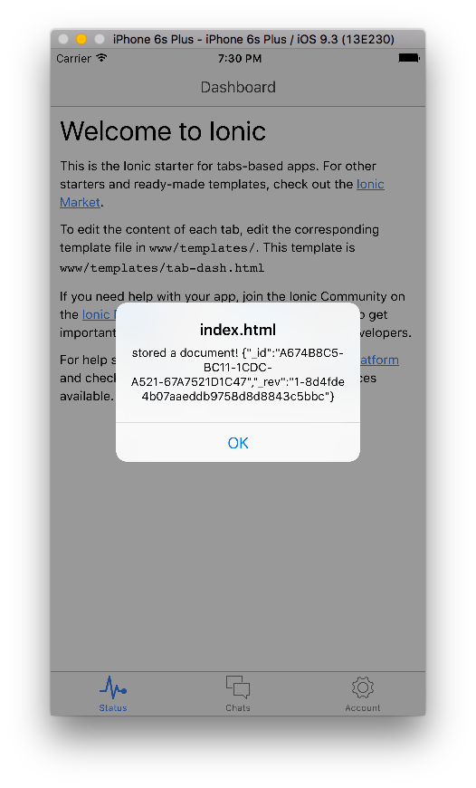
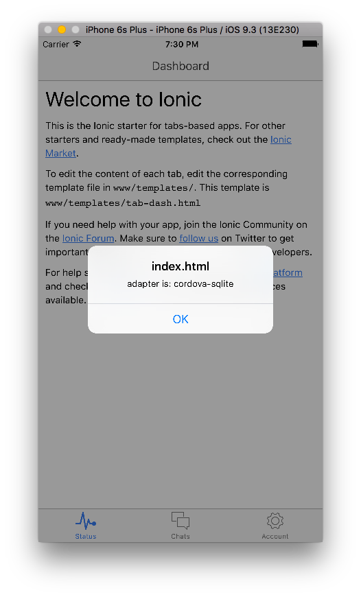

pouchdb-adapter-cordova-sqlite-demo
=====

Demo of using [pouchdb-adapter-cordova-sqlite](http://github.com/nolanlawson/pouchdb-adapter-cordova-sqlite) in an Ionic project.

Check out the code from GitHub, then do:

    cordova prepare
    ionic run ios

You should see:

</img>

</img>
