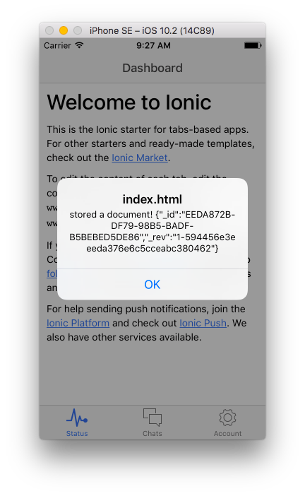
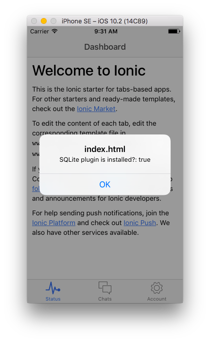

pouchdb-adapter-cordova-sqlite-demo
=====

Demo of using [pouchdb-adapter-cordova-sqlite](http://github.com/nolanlawson/pouchdb-adapter-cordova-sqlite) and [cordova-plugin-sqlite-2](https://travis-ci.org/nolanlawson/cordova-plugin-sqlite-2) in an Ionic v1 project.

The important part of the code is in `www/index.html`:

```html
<script src="js/pouchdb-6.1.2.js"></script>
<script src="js/pouchdb.cordova-sqlite-2.0.2.js"></script>
<script>
  document.addEventListener('deviceready', function () {
    var db = new PouchDB('database.db', {adapter: 'cordova-sqlite'});
    db.post({}).then(function (res) {
      return db.get(res.id);
    }).then(function (doc) {
      alert('stored a document! ' + JSON.stringify(doc));
      alert('adapter is: ' + db.adapter);
      alert('SQLite plugin is installed?: ' + (!!window.sqlitePlugin));
    }).catch(console.log.bind(console));
  });
</script>
```

I also added `cordova-plugin-sqlite-2` to `config.xml`, which is why it gets installed when you run `cordova prepare`.

Building
----

This demo uses a slightly older version of Cordova, so to run it you'll need to do:

    npm install -g cordova@6.2.0

Then check out the code from GitHub, then do:

    cordova platform add ios@4.0.0
    cordova prepare
    cordova run ios

You should see:

</img>

</img>

</img>
